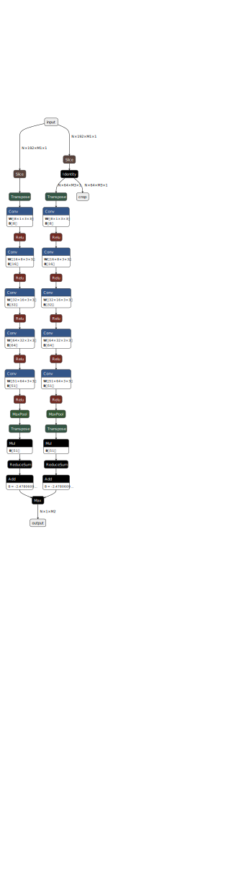

# keyword-detection-onnx-js

### You can check project here 😎: https://defasium.github.io/keyword-detection-onnx-js

This project is designed to identify a keyword on long video or audio files.
That is, the keyword detection problem is being solved. To do this a convolutional neural network trained on spectrograms of male Russian speech is used.
The keyword that the network responds to must contain the word "Donat".
To demonstrate the work, upload a file or record audio using a microphone by pressing a button.
All calculations are carried out on your device and this site easily performs its task without an Internet connection.

## How does it work?
The audio track obtained from the media file is divided into segments lasting a thousand seconds.
Each such segment is fed to the input of the model. The model also outputs a list with float numbers. The position of the number in the list corresponds to the timestamp.
If the number is greater than zero, then we assume that the spoken sound contains the word Donat.

Since recordings of one person's speech were used to train the model the quality of detecting the voices of others will be worse.
Therefore, instead of a threshold value of zero you can set your own value in the settings to increase the sensitivity of the algorithm.

Also, the model often confuses consonant phrases. For example, "zhenyat" or sentences with the pronoun "ona".
Therefore, for convenience, the identified timestamps can be rejected by clicking on the cross next to it.
If you accidentally deleted it, it's okay, the action can be canceled by clicking the undo button.

Finally, the list with timestamps can be saved to the clipboard by clicking the copy button.

## Model's architecture

It's a simple convolutional network with 8, 16, 32, 61 and 128 sequantial 3x3 filters with ReLU activation followed by global max pooling. Model can be applied to images with fixed height (192 pixels) and dynamic width. It was trained with __Tensorflow__ on fixed-sized samples of 1 seconds on dataset with approximately 60 hrs of speech. All audio data was converted to 16 kHz 16 bit wav files with FFmpeg. As for the loss function, the contrastive loss was utilized to distinguish keyword phrases from other ones.

After training the last fully-connected layer was deleted. Features which were extracted after global max pooling were used for training __logistic regression with L1 penalty__ on top of it. Logistic regression was trained on test part of the dataset. The optimal regularization term was estimated via cross validation on 20 folds. Usage of L1 penalty helped to throw away unneccessary filters from last layers (128 -> 51). So the model becomes more lightweight. 

Due to the fact that receptive field of obtained model is roughly __1000ms__ we can replace global max pooling with simple max pooling. This gives us a sequence of values, which can be fed into trained logistic regression as individual samples. 
To make model more accurate the shifted by 500ms spectrogram is processed in parrallel. The final score is maximum between original and shifted images.

Finally, the model was converted to __ONNX__ file format. The resulting binary file was converted to Base64 string.
A newer library [__ONNXRuntimeJS__](https://github.com/microsoft/onnxruntime/tree/master/js/web) was used.
To obtain spectrograms, __ffmpeg.js__ library was used.

Model's architecture acquired from [__Netron__](https://github.com/lutzroeder/netron):

  

